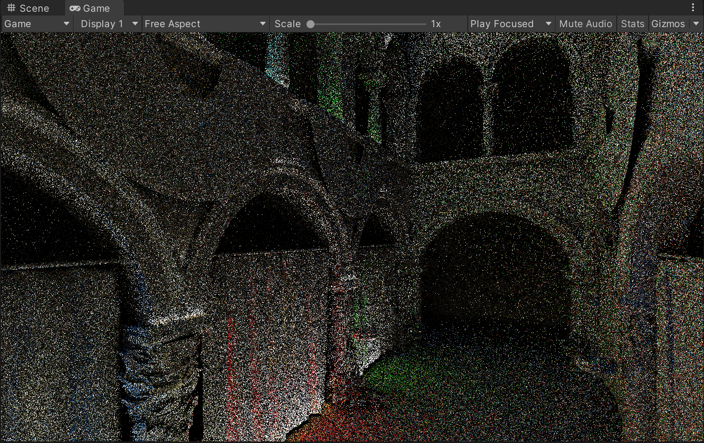
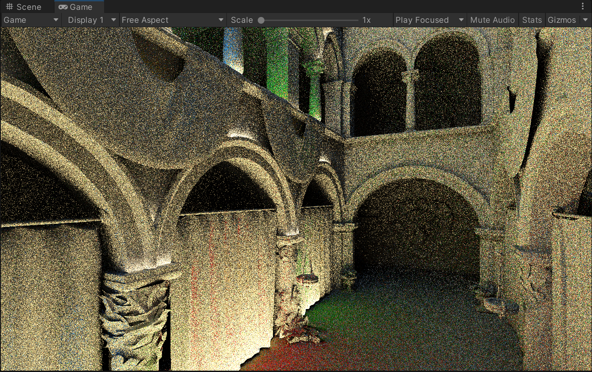
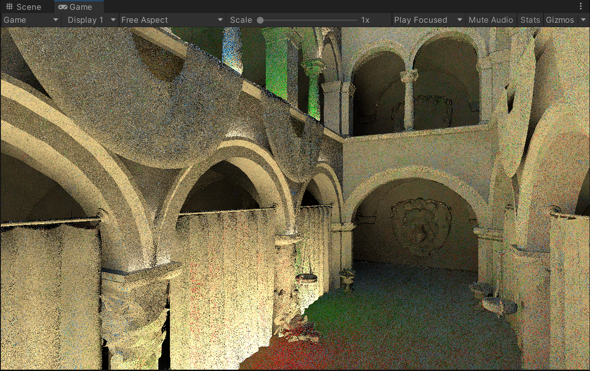
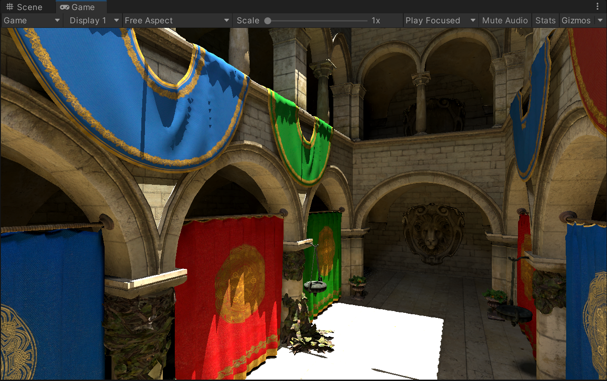
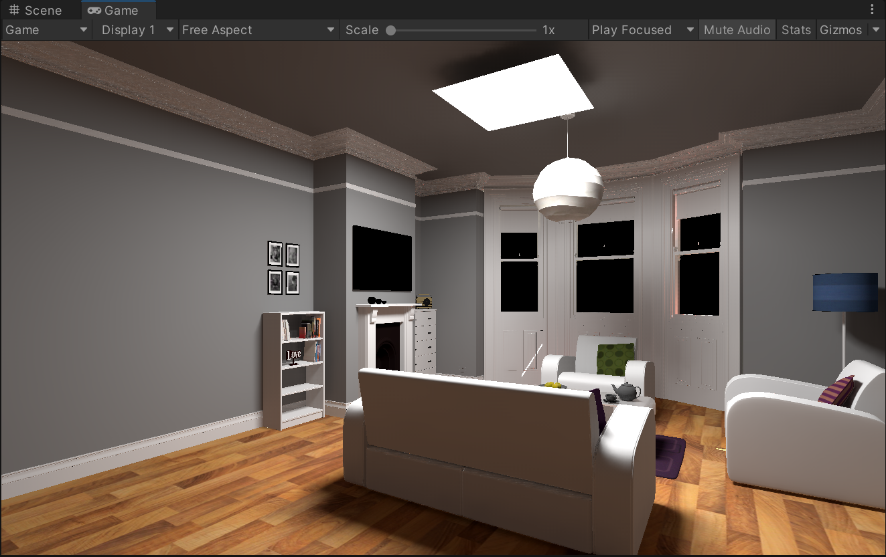
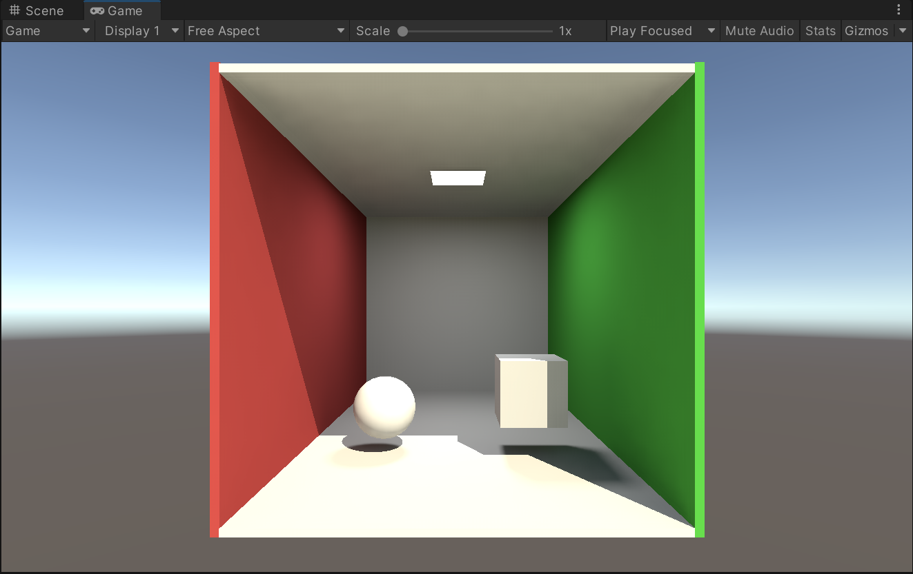

# SVGF + ReSTIR
This project will be implementing the SVGF algorithm and combining it with the ReSTIR method to see if it could improve the rendered quality.

## Results
Path tracer raw result

Path tracer result with ReSTIR temporal accumulation

Path tracer result with ReSTIR spatial and temporal accumulation

**Sponza**

**Room**

**Cornell Box**
